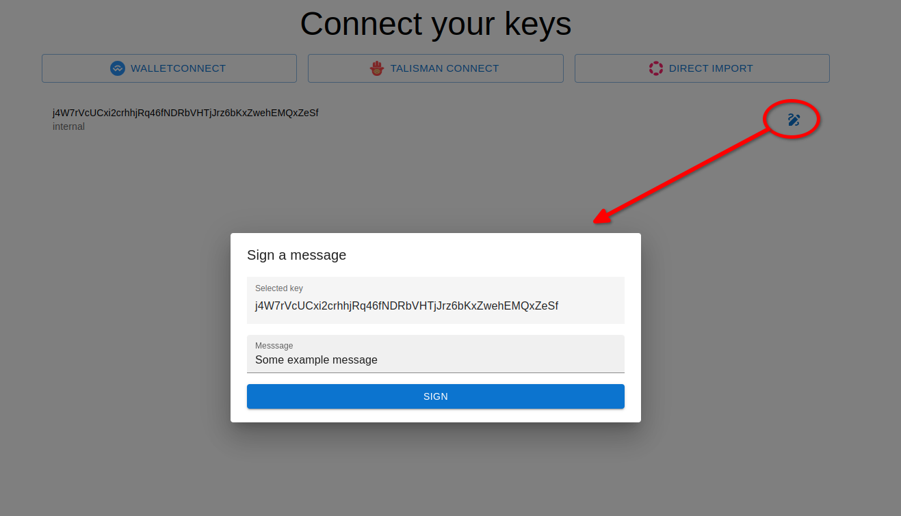

import {GhLink, consts} from '@site/src/utils';
import CodeBlock from '@theme/CodeBlock';

# Keys module

The keys module of Joystream SDK facilitates the management of keys and integrations with external signers.

## Key features

- simplifies [WalletConnect](https://walletconnect.network/) integration,
- uses [`@polkadot/keyring`](https://polkadot.js.org/docs/api/start/keyring/) internally to manage the set of available keys,
- provides a unified interface to access all available keys, regardless of their source (whether they are directly added to the Keyring, provided by WalletConnect or via other extensions)
- environment agnositc, works both in the browser and Node.js environments.

## KeyManager class

`KeyManager` is main class provided by the keys module.
Creating a new instance of `KeyManager` is extemely simple:

```typescript
import { KeyManager } from '@joystream/sdk-core/keys'

const keyManager = new KeyManager()
// Optionally, if you didn't call cryptoWaitReady() before:
await keyManager.ready()
```

You can also override the default Keyring configuration if you need:

```typescript
const keyManager = new KeyManager({
  keyringOptions: {
    isDev: true, // Will import all dev accounts like //Alice, //Bob etc.
    type: 'sr25519', // The default key type will be 'sr25519'
    // ...
  },
})
```

### Adding keys directly

You can add new keys directly to KeyManager, similarly to how you would add them to a [`Keyring`](https://polkadot.js.org/docs/api/start/keyring/) instance:

```typescript
// Add from mnemonic
keyManager.addKey({
  mnemonic:
    'bottom drive obey lake curtain smoke basket hold race lonely fit walk',
  type: 'sr25519', // Would use the default type if not provided
  meta: { name: 'Dev' }, // You can optionally add some metadata
})

// Add from SURI
keyManager.addKey({
  suri: '//Alice',
  // ...optionally other options can be provided as above
})

// Add from seed:
keyManager.addKey({
  seed: '0xe5be9a5092b81bca64be81d212e7f2f9eba183bb7a90954f7b76361f6edb5c0a',
  // ...optionally other options can be provided as above
})
```

### Using external providers

KeyManager allow you to add external key provides as long as they match the following interface:

```typescript
interface KeyProvider {
  signer?: Signer
  getAccounts(): Promise<{ address: string }[]>
  subscribeAccounts(cb: (keys: KeyInfo[] | undefined) => void): unknown
}

interface KeyInfo {
  address: string
  type?: KeyType
  name?: string
}
```

This interface is compatible with some of the most popular packages for connecting wallets, such as:

- [Talisman Conenct](https://github.com/TalismanSociety/talisman-connect)
- [@polkadot-onboard](https://github.com/paritytech/polkadot-onboard)

It's also combatible with the `WalletConnect` class that you can import from `@joystream/sdk-core/keys/integrations/wallet-connect` (see [WalletConnect integration](#walletconnect-integration)).

To add a key provider which matches this interface to a `KeyManager` you can simply call:

<pre>
keyManager.addKeysProvider(**_PROVIDER_NAME_**, **_PROVIDER_**)
</pre>

See [WalletConnect integration](#walletconnect-integration) for a more concrete example.

### Retrieving keys

To retrieve all available keys from the `KeyManager` you can use one of the following methods:

```typescript
// Retrieve keys once:
const keys = keyManager.keys

// Subscribe keys:
const unsubscribe = keyManager.subscribeKeys((keys) => {
  /* Do something with the keys */
})
```

The returned keys will match the following interface:

```typescript
interface Key {
  // Name of the provider specified during `.addKeysProvider`
  // or 'internal' if the key was added directly to the Keyring
  provider: string

  // SS58 address of the key (uses the Joystream network prefix by default)
  address: string

  // Type of the key (if specified)
  type?: 'ed25519' | 'sr25519'

  // meta.name if specified
  name?: string
}
```

### WalletConnect integration

`@joystream/sdk-core/keys` provides a `WalletConnect` class to allow very easy integration with [Wallet Connect](WalletConnect).
See the minimal example below:

```typescript
import { KeyManager } from '@joystream/sdk-core/keys'
import { UxHandler } from '@joystream/sdk-core/keys/integrations/wallet-connect/ux'
import { WalletConnect } from '@joystream/sdk-core/keys/integrations/wallet-connect'

const keyManager = new KeyManager()
await keyManager.ready()

// Specify the actions to take on connection request
// and (optionally) when the connection process is finalized.
const wxUxHandler: UxHandler = {
  requestConnect: async (uri: string) => {
    /* Show a QR code or allow the user to copy the WalletConnect uri manually */
  },
  onFinalized: async (uri: string) => {
    /* For example: close the WalletConnect modal */
  },
}

const walletConnect = new WalletConnect(
  {
    projectId: process.env.PROJECT_ID, // You must provide a valid PROJECT_ID here!
    relayUrl: 'wss://relay.walletconnect.com',
  },
  wxUxHandler
)

await walletConnect.connect()
await keyManager.addKeysProvider('WalletConnect', walletConnect)

console.log(keyManager.keys)
```

For more concrete examples, see [Example apps](#example-apps) below.

## Example apps

### React

The example React app which uses `@joystream/sdk-core/keys` module can be found in <GhLink to="/examples/keys-react" />.

To run the example locally you can execute the following steps:

<CodeBlock languague="bash">
git clone {consts.gh.cloneUrl} joystream-sdk
cd joystream-sdk
git checkout {consts.gh.mainBranch}
yarn
cd examples/keys-react
yarn start
</CodeBlock>

You should see a simple UI like this:


The example React app allows you to add keys using 3 different ways:

- using [Talisman Connect](https://github.com/TalismanSociety/talisman-connect), which supports most popular browser extensions / injected wallets, such as:
  - Talisman
  - SubWallet
  - Nova Wallet
  - Polkadot.js
  - etc. (see full list [here](https://github.com/TalismanSociety/talisman-connect/tree/main/packages/connect-wallets/src/lib))
- using [WalletConnect](https://walletconnect.network/), which supports:
  - Mobile / Desktop wallets such as:
    - Subwallet
    - Nova Wallet
  - Tangem hardware wallet
  - etc. (see full list [here](https://walletguide.walletconnect.network/))
- direcly to Keyring from:
  - mnemonic
  - seed
  - [SURI](https://polkadot.js.org/docs/keyring/start/suri/)

You can verify the signing process by signing an example message using the `Sign` button:



### CLI

The example CLI app which uses `@joystream/sdk-core/keys` module can be found in <GhLink to="/examples/keys-cli" />.

To run the example locally you can execute the following steps:

<CodeBlock languague="bash">
git clone {consts.gh.cloneUrl} joystream-sdk
cd joystream-sdk
git checkout {consts.gh.mainBranch}
yarn
yarn run-example keys-cli
</CodeBlock>
